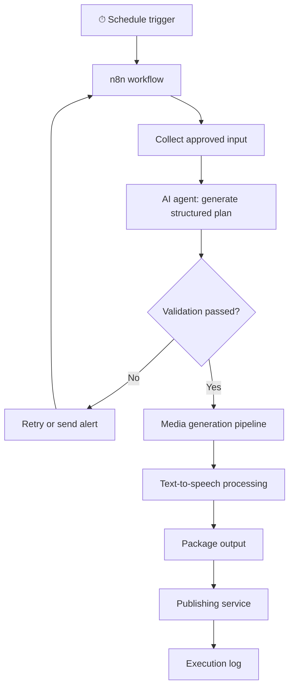
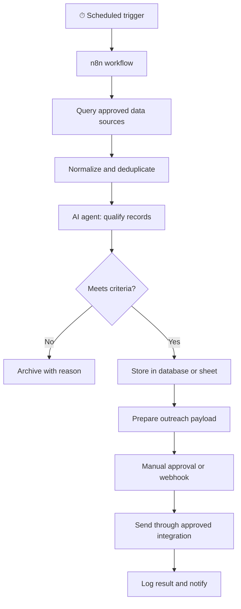
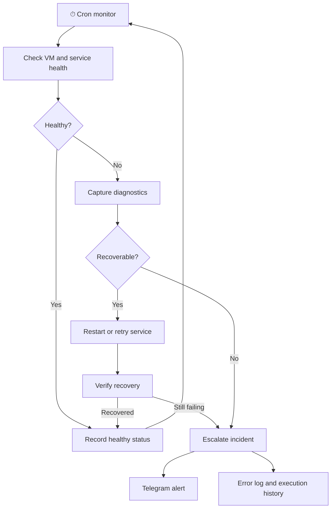
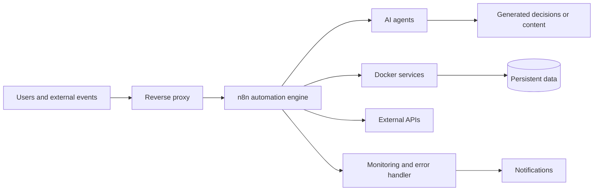

# Eraser workflow diagrams

These sanitized flowcharts can be pasted into Eraser using **Diagram as Code**. Replace the text labels with Eraser icons from the icon library where available: `n8n`, `Docker`, `AI`, `cron`, `webhook`, `database`, `YouTube`, and `Telegram`.

## 1. Autonomous media pipeline

## 2. Lead generation and outreach

## 3. VM health monitoring and failover

## 4. Platform overview

## Privacy checklist

Do not include channel names, content topics, domains, IP addresses, usernames, credentials, customer names, private URLs, or internal container names in the public diagrams.
